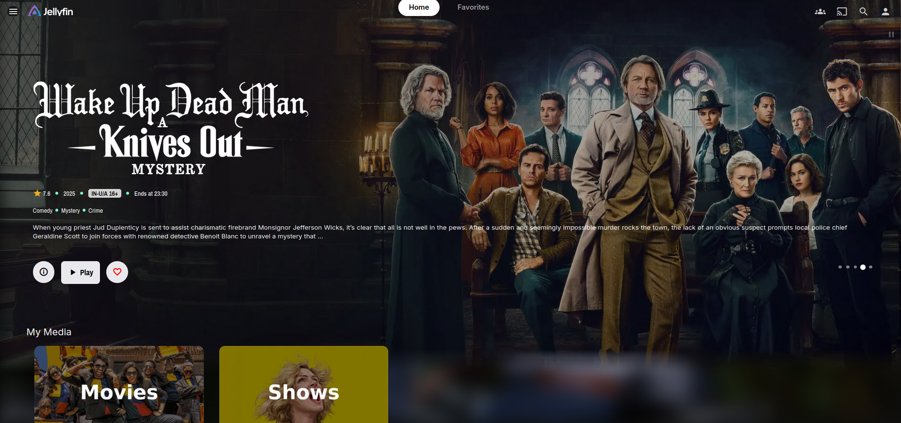
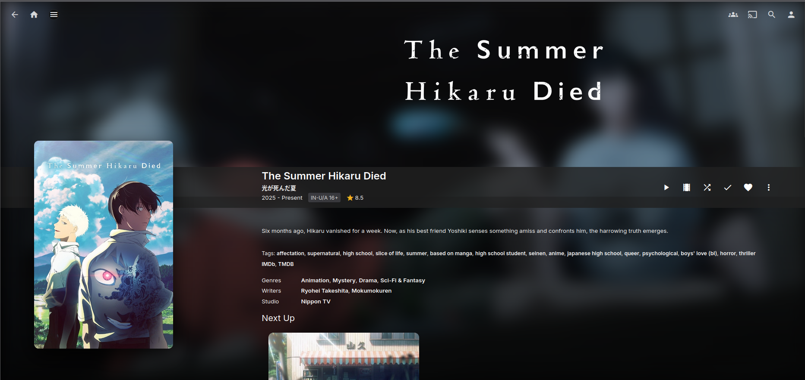
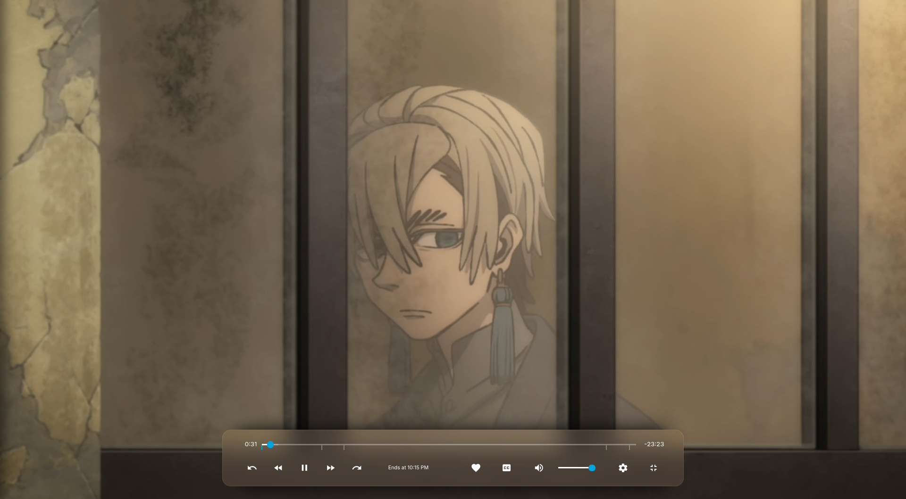

# 🍎 ijelly

A pixel-perfect, functionally robust Apple TV-inspired theme for Jellyfin. **ijelly** brings a premium, glassmorphic aesthetic and tactile interactions to your media library, optimized for both desktop and lean-back TV experiences. This theme is optimized for samsung TV's and Desktop.

---

## 📸 Showcase

*Modern, immersive library view with glassmorphic elements.*

*Cinematic detail page with high-contrast typography and hero backdrops.*

*Revamped OSD layout for distraction-free playback control.*

---

## ✨ Features

- **💎 Elite Glassmorphism**: Consistent frosted glass effects across all menus, dropdowns, dialogs, and the search overlay.
- **🏃 Spring-Physics Animations**: Tactile, "bouncy" card zooms and button presses that mimic the native Apple TV 4K experience.
- **🎬 Cinematic Item Details**: Immersive "Hero" backdrops with seamless gradient transitions and enlarged posters for a stunning focus on your media.
- **📺 TV Optimized**: Stabilized grid flow and increased card sizes specifically for high-resolution TV layouts.
- **🔡 Pixel-Perfect Clarity**: Advanced **Layer Isolation** techniques ensure zero font blur and razor-sharp text on all glass surfaces.
- **💊 Modern Pill Navigation**: A sleek, underscore-free navigation system with spring-animated feedback.

---

## 🚀 Installation

1. Go to your Jellyfin **Dashboard** -> **General**.
2. Scroll down to **Custom CSS**.
3. Add @import url('https://cdn.jsdelivr.net/gh/safiyu/ijelly@main/ijelly.css');
4. Click **Save**.
5. **Settings** -> **Display** -> Enable Backdrops.

---

## 🛠️ Design Philosophy

**ijelly** is built on the principles of **Aesthetics, Responsiveness, and Clarity**. Every element—from the mathematically precise shadows to the sub-pixel antialiasing—is engineered to provide a first-class "Pro" experience that makes your Jellyfin server feel like a premium native application.

---
