# ijelly

Six themes for Jellyfin. Covers everything from Apple TV glass to museum gallery to editorial print. Built for Jellyfin Web **12+**, with the new Modern / React-MUI chrome. Tuned for desktop and Samsung Tizen TVs.

| Stock Jellyfin | ijelly Blueprint |
| :---: | :---: |
| 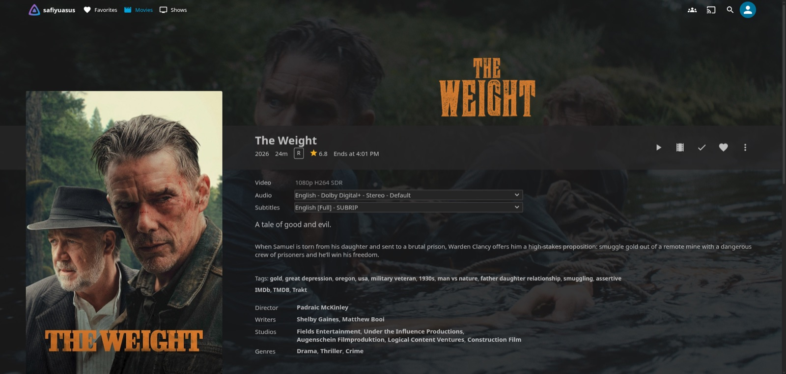 | 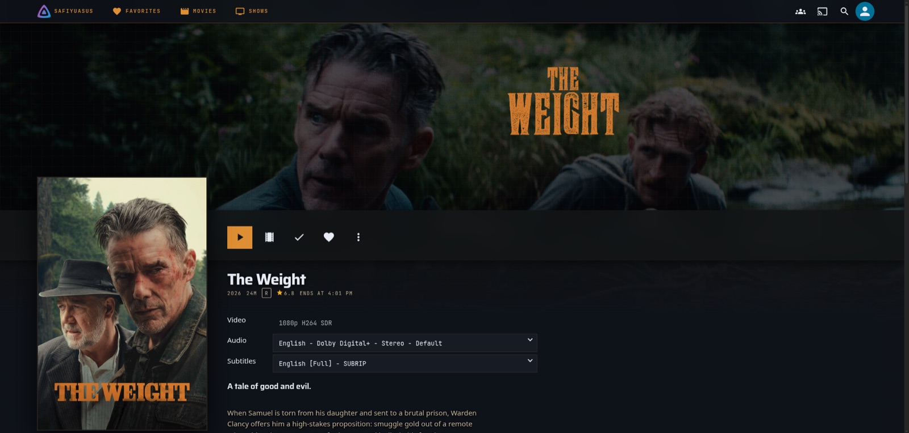 |

## Contents

1. [Themes](#themes)
2. [Installation](#installation)
3. [TV layout](#tv-layout)
4. [Showcase page](#showcase-page)
5. [Compatibility](#compatibility)
6. [Customising](#customising)
7. [License](#license)

## Themes

| Theme | File | Direction |
| :--- | :--- | :--- |
| **Apple TV** | `ijelly.css` | Dark glass, pill navigation, spring-physics cards, white primary accents. The native tvOS feel. |
| **Cinematheque Noir** | `ijelly_noir.css` | Warm sepia, Didone serif titles, brass hairline poster frames, film-grain overlay, italic lowercase sections. |
| **Editorial** | `ijelly_editorial.css` | Letterboxd meets The New Yorker. Deep ink, cream, ink-red accent. Serif display, byline metadata, asymmetric shelves, pull-quote synopsis. |
| **Gallery** | `ijelly_gallery.css` | MoMA-wall minimalism. Charcoal walls, cream-matted posters inside gold hairline frames, museum wall-tag captions, opacity-only focus. |
| **Blueprint** | `ijelly_blueprint.css` | Deep navy-black, ember amber accent, square corners, mono uppercase annotations, dashed borders, blueprint grid overlay. Based on the kontexta.dev dark palette. |
| **Poster-Tinted** | `ijelly_tinted.css` | Dark base where the page takes the colors of the current art. A blurred copy of the backdrop washes the UI, and focused posters get a halo made from their own image. CSS only, so it works on TV apps. |

### Apple TV

Dark glass bars, pill navigation, rounded cards and a two-row floating player bar.

| Library | Detail |
| :---: | :---: |
| 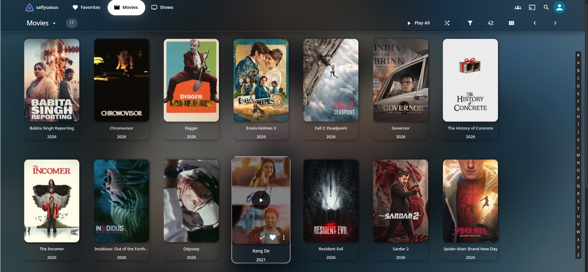 | 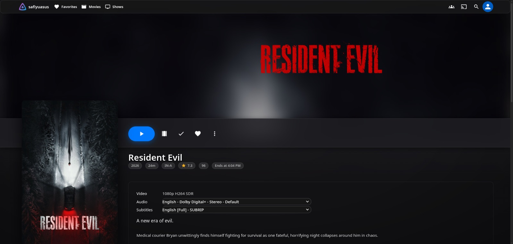 |

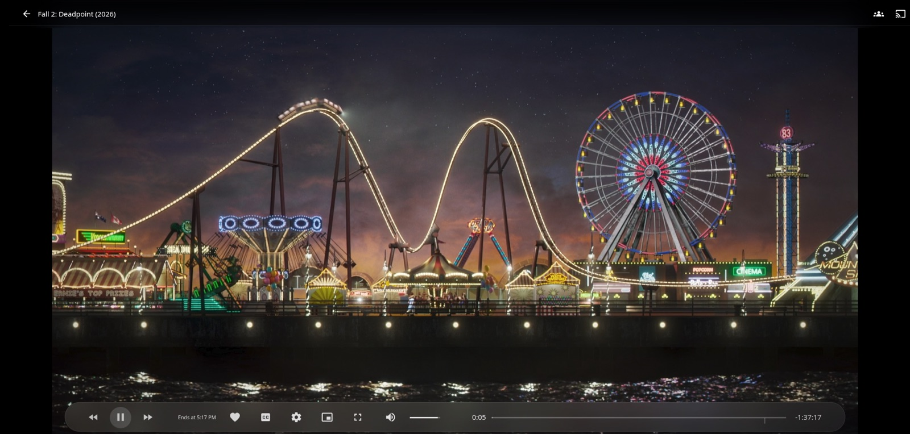

### Cinematheque Noir

Warm sepia surfaces, serif titles and brass frames around every poster.

| Library | Detail |
| :---: | :---: |
| 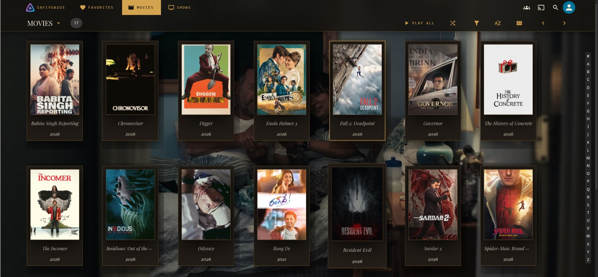 | 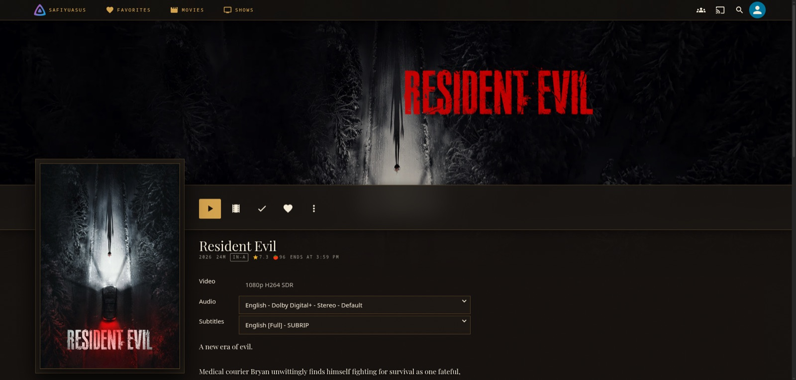 |

### Editorial

Deep ink with cream type and an ink-red accent. The first poster on each shelf is set larger, like a magazine spread.

| Library | Detail |
| :---: | :---: |
| 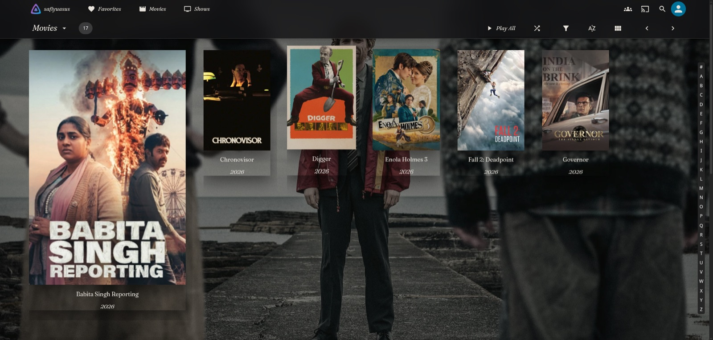 | 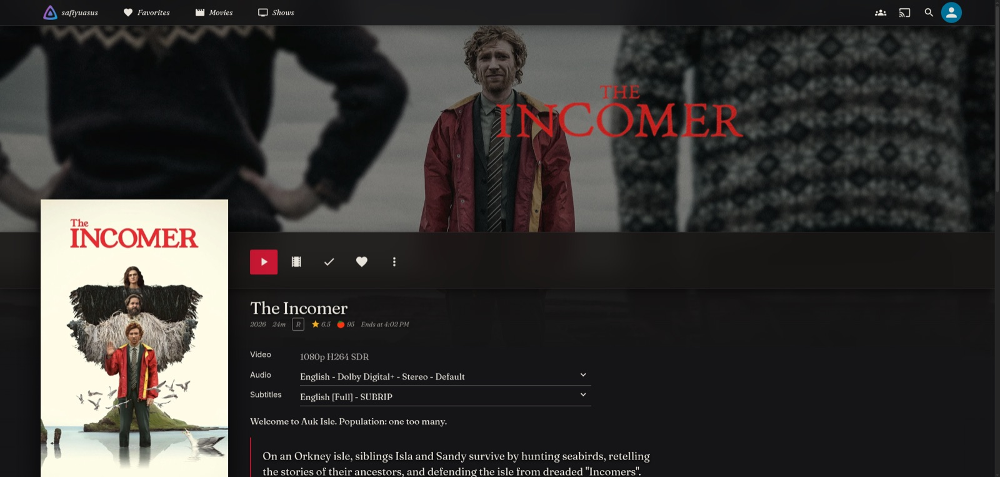 |

### Gallery

Cream mats inside gold frames on a charcoal wall, with museum wall-tag captions.

| Library | Detail |
| :---: | :---: |
| 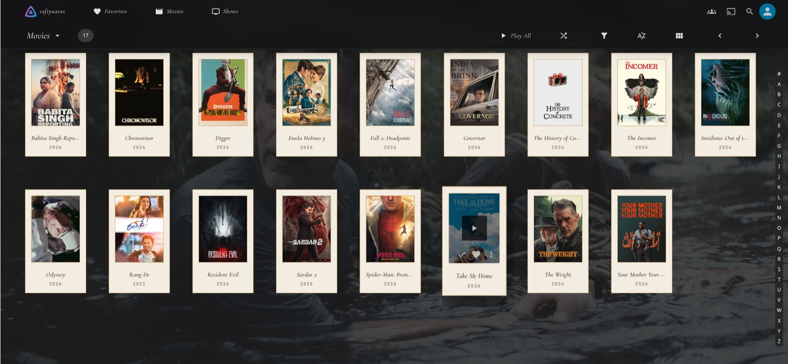 | 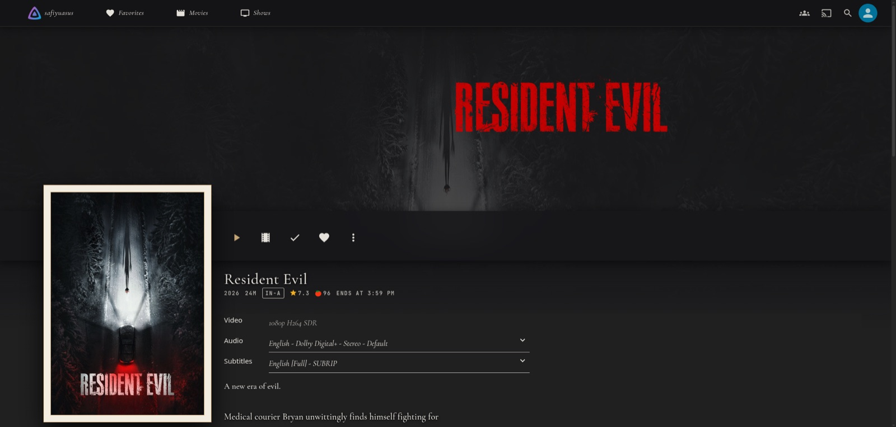 |

### Blueprint

Navy-black with ember amber, square corners and mono uppercase annotations.

| Library | Detail |
| :---: | :---: |
| 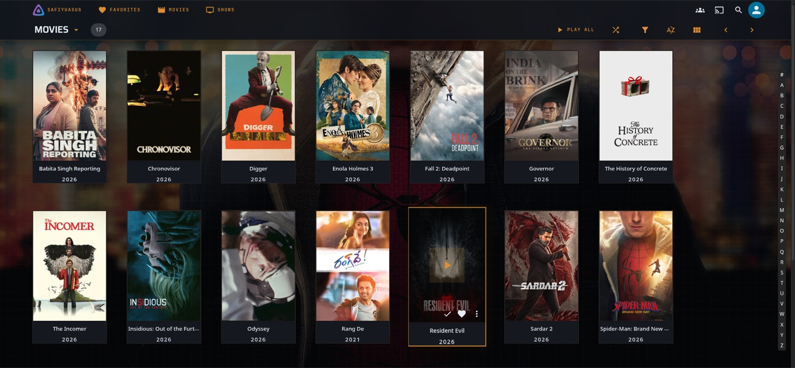 |  |

| Cast and crew | Player |
| :---: | :---: |
| 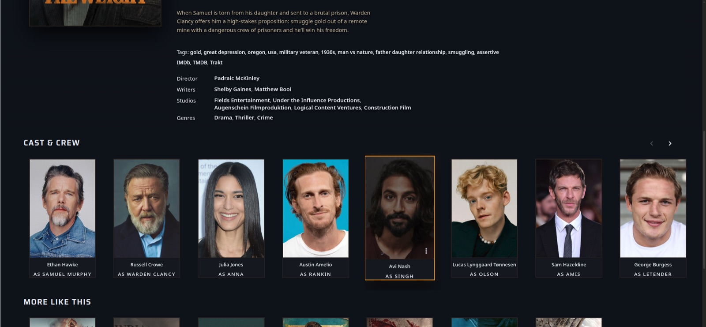 | 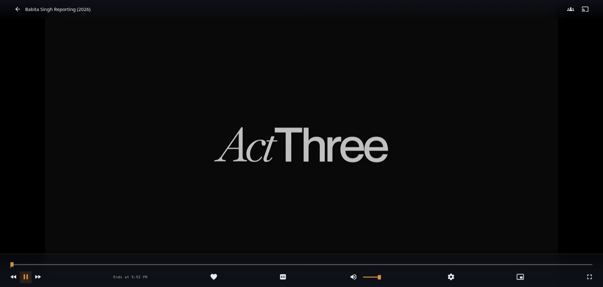 |

### Poster-Tinted

The page takes its colors from the current art. No script needed.

| Library | Player |
| :---: | :---: |
| 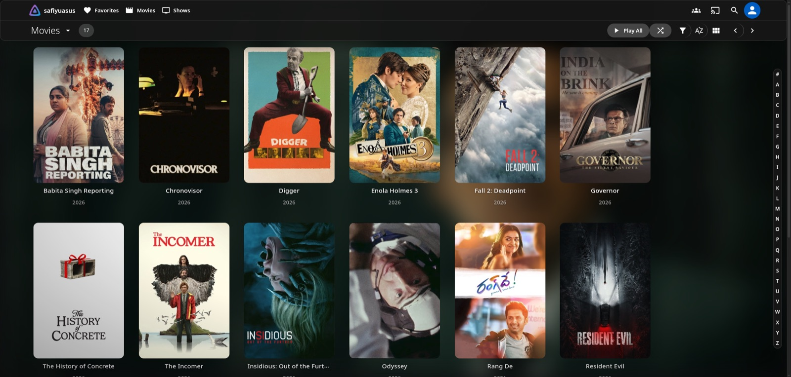 | 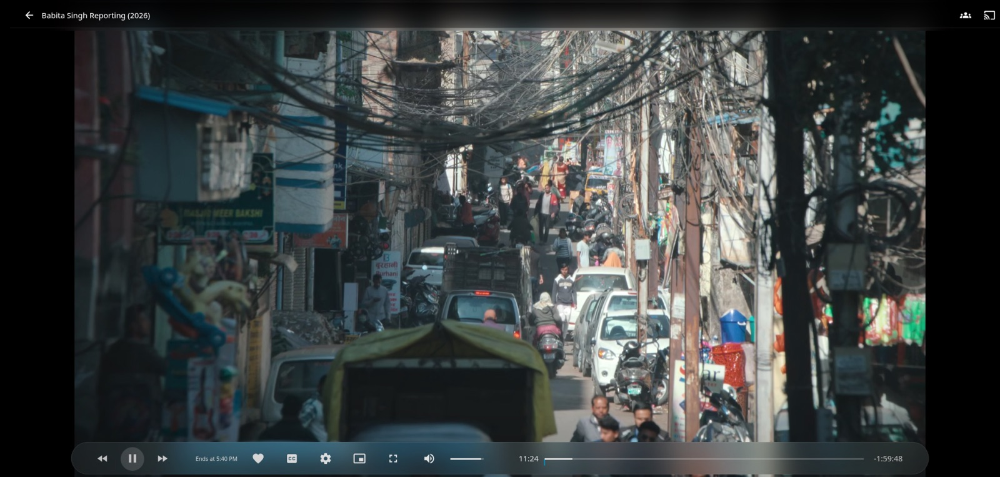 |

## Installation

Open **Dashboard › General › Custom CSS** and paste one of the imports below. Save, then enable **Settings › Display › Backdrops**.

The `@latest` tag tracks the newest release. jsDelivr caches it, so a new release can take a while to show up. To pin a version, replace `@latest` with a release tag such as `@2.0.13`. A pinned tag never changes and is never stale.

### Apple TV

```css
@import url('https://cdn.jsdelivr.net/gh/safiyu/ijelly@latest/ijelly.css');
```

### Cinematheque Noir

```css
@import url('https://cdn.jsdelivr.net/gh/safiyu/ijelly@latest/ijelly_noir.css');
```

### Editorial

```css
@import url('https://cdn.jsdelivr.net/gh/safiyu/ijelly@latest/ijelly_editorial.css');
```

### Gallery

```css
@import url('https://cdn.jsdelivr.net/gh/safiyu/ijelly@latest/ijelly_gallery.css');
```

### Blueprint

```css
@import url('https://cdn.jsdelivr.net/gh/safiyu/ijelly@latest/ijelly_blueprint.css');
```

### Poster-Tinted

```css
@import url('https://cdn.jsdelivr.net/gh/safiyu/ijelly@latest/ijelly_tinted.css');
```

No script needed. CSS cannot read pixel colors, so the tint comes from blurred copies of the art itself: the backdrop washes the page and each focused poster glows in its own colors. The accent color stays white.

### Refreshing the cache

If `@latest` still serves an old version after a release, purge it for the theme you use:

```
https://purge.jsdelivr.net/gh/safiyu/ijelly@latest/ijelly_gallery.css
```

## TV layout

Every theme has a layout for the Jellyfin TV mode (Settings › Display › Layout › TV), including the Samsung Tizen app.

- **Detail page:** the same layout as desktop. Backdrop banner, poster overlapping it, action buttons beside the poster, then the title and description.
- **Home and library:** safe margins, six posters per row sized to the screen, and compact captions so more rows fit.
- **Player:** a seek bar on its own row with the controls packed together underneath. Apple TV uses a floating two-row pill.
- **Tizen app:** keep the Jellyfin app on your TV up to date. An outdated app can lay pages out differently from the web client.

## Showcase page

`index.html` is a one-page showcase of all six themes with every screenshot and a copy button for each import line. Serve the repo and open it in a browser, or publish it with GitHub Pages (Settings, Pages, deploy from the `main` branch root):

```bash
python3 -m http.server 8000
```

Then open `http://localhost:8000/`.

`launch.html` lays out all six themes with two pages each on one 2400 px canvas, for launch posts and social cards. Open `launch.html?full` for the exact pixel size, or use the ready-made render in `screenshots/launch-sheet.png`.

## Compatibility

| Platform | Status |
| :--- | :--- |
| Jellyfin Web 12+ (Modern / React-MUI) | Chrome and content both re-skin without a mode toggle. Each theme targets the MUI app bar, drawer, dialog, tab, button, and input components alongside the legacy detail and library views. The Apple TV theme additionally maps its tokens onto Jellyfin 12's native `--jf-palette-*` and `--mui-palette-*` variables. |
| Samsung Tizen TV app | Tested on a 2024 Neo QLED. Subtitle OSD lift uses body-class fallbacks and `:has()` as a progressive enhancement. |
| Mobile and tablet (≤ 1000 px) | Backdrop blur is reduced or disabled to avoid GPU stalls on low-power devices. |

Older Jellyfin versions are not tested.

**Fonts:** The Apple TV theme uses the OS system font stack and makes no network requests. Noir, Editorial, Gallery, and Blueprint load static font files (**Playfair Display**, **Fraunces**, **Inter**, **Cormorant Garamond**, **Saira**, **JetBrains Mono**) from jsDelivr, the same CDN that serves the CSS, so there is no Google Fonts request and no variable font that older TV browsers could fail on. If the fonts cannot be reached, the system fonts take over and the themes still read correctly, just less distinctive.

## Customising

Each theme exposes its design tokens as CSS custom properties on `:root`. Override them in your own Custom CSS block, placed after the `@import`.

| Theme | Token prefix |
| :--- | :--- |
| Apple TV | `--apple-*` |
| Cinematheque Noir | `--noir-*` |
| Editorial | `--ed-*` |
| Gallery | `--gl-*` |
| Blueprint | `--kxta-*` |
| Poster-Tinted | `--pt-*` |

Example. Swap the Apple TV accent for hot pink:

```css
:root {
    --apple-accent: #ff375f;
}
```

## License

Released under the [MIT License](LICENSE).
